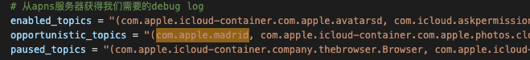

# imessage-api
# 全套imessage推信协议imessage/FaceTime群发技术总结(真机+纯协议)
# 我们已经完成了全部的协议逆向工作。有兴趣的朋友可以加我✈️:[@Leonard_Ph_D](https://t.me/Leonard_Ph_D)一起沟通学习。

## 1，imessage是什么：
iMessage是苹果公司推出的即时通信软件，可以发送短信、视频等，安全性好。不同于运营商短信/彩信业务，用户仅需要通过WiFi或者蜂窝数据网络进行数据支持，就可以完成通信。
比起传统短信来说，发送消息无需实名，无短信费，送达率高。

## 2，imessage群发的主要实现方式：
### 2.1 群控类：
基于mac或者iTouch，在硬件运行群发脚本，需要硬件投入，并且对场地、电力要求较高。
### 2.2 API类：
直接调用苹果的iMessage协议，以破解证书形式进行发送，发送速度快，并且不需要投入太多硬件成本。但技术门槛高。
### 3，技术思路：
本文分两部分讲解真机群控 和 协议的具体实现方式。先讲群控： 
### 3.1：群控：
过去，iMessage垃圾信息主要依靠第一种，也就是通过iPod Touch、旧款iPhone等廉价iOS设备进行“群控”运行脚本，以一部主机控制多台手机自动操作的形式，发送iMessage垃圾信息。这种方式不仅十分耗费成本，而且在“删除并报告垃圾信息”功能推出后，“群控”设备还有被苹果BAN机（禁用iMessage）的风险。

对于macOS可以使用AppleScript来实现群发，使用四叶草配置工具注入三码，然后登录账号，开始推信。这个方案小编这里就不累述了。macOS群发方案缺陷挺多，包括封端口，硬件成本，发送速率，封号，消息进入垃圾箱等各个方面都不如人意。有兴趣的朋友可以自己研究一下这块的方案。
下面开始细说一下真机群发的方案。
这里使用低版本IOS来详细讲解，高低版本思路都是共通的。
开发工具的选择上，这里选择触动精灵来实现自动化。

真机群发大致流程如下：
真机改码(低版本-8码 高版本-14码) - 登录账号 - 推信

先说改码，每一个iphone都有自己的设备标识。iphone激活时会向苹果服务器发起请求，获得设备证书。设备证书在激活imessage的时候会使用到。
低版本8码包括序列号，imei，mac地址，销售型号，产品类型，ECID等数据。具体数据的来源各位可以搜索引擎去查找一下。
话不多说，直接上改码的代码：

改码具体函数

改完码之后，要重启并激活设备。激活代码如下：

激活的激活流程可以通过默认配置+触动精灵寻色自动点击来完成激活。

设备激活完成后，开始登录apple id到imessage，

登录流程非常简单，根据界面自行抓色实现即可。
登录完成之后，就可以开始群发短信了。

发送的步骤很简单。输入号码和内容，然后发送。但是需要注意，这里要检测号码是否变蓝。只有蓝号才能发送
以上就是真机群发的全部内容，有相关开发基础的用户很容易就能上手实现。
接下来我们讲一下ims协议的实现。
#  3.2：协议：
协议实现起来比真机要复杂非常的多。这里建议读者需要具备一定的逆向思维，了解各种加解密算法的原理。
iMessage是整个Apple生态系统中广泛使用的安全消息传递应用程序和协议。

iMessage发送代码（像XNU OS中大多数内部函数一样）已经超出了Messages.app的范围，并且该进程依赖于许多系统守护程序，即微服务体系结构，并且它们依赖XPC消息作为IPC（进程间通信）机制。

如果我们编辑好一条消息，并按下回车键，就会经历Messages.app -> imagent -> identityservicesd -> apsd的过程。

逆向整个流程非常的耗时费力。但好消息是我们已经完成了所有这部分的工作。接下来，我向大家大概讲述一下全流程和整个的技术原理。

imessage最基本的一个组件是Apple推送服务，就是我们常说的APNS(Apple Push Notification service)。做过ios开发的同学都知道，当我们开发一个app需要能推送消息给用户时，我们需要接入APNS。当APP连接到APN时，我们会收到一个DeviceToken，用来标识特定的设备。
类似下面这个函数：

但是和imessage不同的是，这个令牌仅限于应用程序自己使用，和应用的bundleId绑定。

imessage这里的做法呢，有所不同。当我们向一个设备发送推送时，我们需要指定一个消息主题。这里需要写com.apple.madrid，当设备连接到APNS的时候，会向苹果的服务器发送一条消息，告诉服务器我们接受那些消息。话不多说，我们看一下这块的代码：

事实上，APNs不只是用来传递ims消息。苹果IDS也是用APNS的伪HTTP层来发送查询和响应。
说到这里，各位读者可能不清楚IDS是啥，接下来我们详细的讲一下苹果的IDS服务。

IDS全程 Apple Identity Service。当用户在设备上打开 iMessage 信息后，设备会生成加密和签名密钥对供这一服务使用。加密使用了用于加密的 RSA 1280 位密钥和 NIST P-256 曲线上用于加密的 EC 256 位密钥。签名使用了椭圆曲线数字签名算法 (ECDSA) 256 位签名密钥。私钥存储在设备的钥匙串中，并且只有在首次解锁后才可用。公钥则与设备的 APNs 地址一起发送至 Apple 身份识别服务 (IDS)，在身份识别服务中，公钥会与用户的电话号码或电子邮件地址关联在一起。

事实上，FaceTime也是使用的相同的技术原理。但是他的主题和imessage不同。称之为com.apple.ess
IDS作为imessage和FaceTime等其他一些服务的密钥服务器，因为服务是端到端加密的，所有每一个用户的公钥都必须要能安全的交换。
注册IDS的第一步是获得用户的身份令牌。通过apple id的账号密码向IDS注册。

# 这里有一个需要注意的点：
早期的ios设备的苹果账号是没有二次验证的。也就是我们俗称的2FA。因为兼容问题，IDS API对于2FA这块的处理有一个专门的参数。用于标识身份验证是老版本(2FA代码直接附加到密码的末尾输入)和新版本的GrandSlam选项。

获得身份令牌之后，我们必须要更换为长效身份验证证书。这个证书仅允许向IDS进行注册。但是无法获取密钥。

当我们发送IDS注册请求的时候，我们需要向API传递一个名称为validation data的二进制数据。这个数据是Apple用于是被设备的信息。
数据里面包含序列号，型号，ICCID等等数据。因为数据是高度混淆的，所以我们找到他的生成规则。示例代码如下：

注册完成后，我们会收到IDS回传的token，类似下图：

拿到token之后，我们就能开始查找公钥。示例代码如下：

回传结果会包含用户的身份列表。身份中的每一个都对应登录了此账号的设备和详细信息。比如说公钥，推送令牌，会话令牌等。类似下图：

好了！
到这里我们已经完成了前面的准备工作，只要和APNS结合起来就能开始收发消息了。

为了能够接受到消息，我们仅需要找到APNS的连接com.apple.madrid并发送状态包。
根据我们想IDS注册时所使用的信息，以及对方发送消息的ios版本。我们可能会收到新老两种版本的消息(ios13之前为老版本)。老版本使用的pair加密格式，新版本使用的pair-ec格式。
我们可以选择验证消息签名。这里为了省事，就不验证了。
示例代码如下：

发送消息和接受消息完全相反。我们可以向单个用户发送消息，也可以组群发送。
请注意！
发送消息时，消息会传递到聊天中的所有用户，包括你自己登录在其他设备上的同一账号
另外还有一个关键点。AES密钥并不是完全随机的。带有HMAC标记。 如果你使用完全随机的AES密钥，那么在新版本的设备上将无法解密你的消息。会导致发送失败。
示例代码如下：

到这里，我们就完成了协议端的消息发送与接受。看起来是不是很简单？各位可以根据以上思路自行实现推送协议。

我们已经完成了全部的协议逆向工作。有兴趣的朋友可以加我✈️:[@Leonard_Ph_D](https://t.me/Leonard_Ph_D)一起沟通学习。

